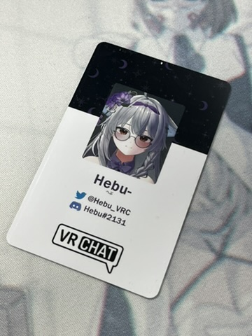
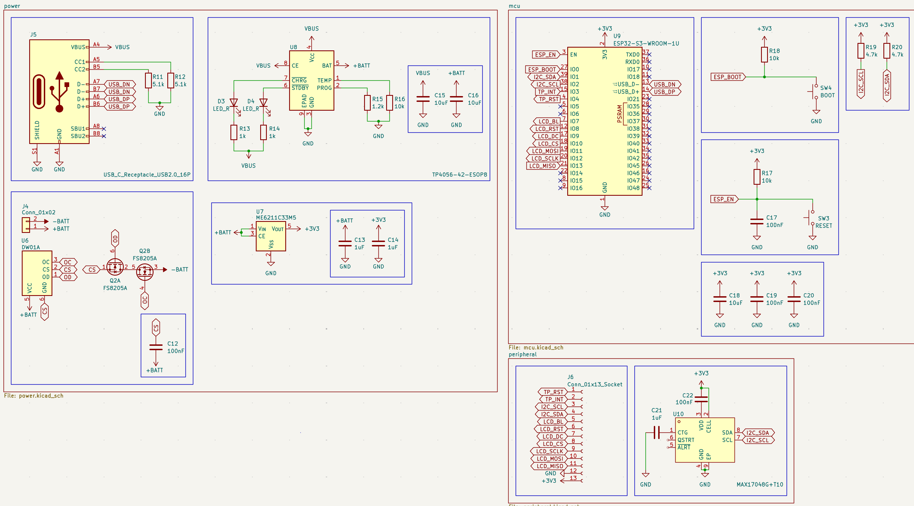

# VRCBadge

I made RFID namecard before (for friends and myself) 
and you know, all VRC players change avatar quite often.

After making those namecards 3 times (dumb), 
I decided to make a digital badge for myself. (simple + fun toy project!)

It's gonna be a wearable digital badge powered by ESP32-S3 
Namecard looking UI (Yes, changeable image ofc) 
editable profile information (twitter, discord etc..), and future RFID door key emulation.

This project is inspired by Github Conference Badge video, posted by Wes Bos. [Ref Video](https://youtu.be/_jPm_zN95FE?si=vHjaHDR8lpRF7iKP)

### Schematic

Custom 2-layer PCB designed for JLCPCB fabrication.
USB-C input with TP4056 LiPo charging, DW01A+FS8205A battery protection, and ME6211 3.3V LDO.
ESP32-S3-WROOM-1U drives a 3.5" SPI LCD with capacitive touch, while a MAX17048 fuel gauge tracks battery level over I2C.

### UI Preview

Badge UI built with [Slint](https://slint.dev).

## Documentation

See [/docs](./docs/README.md) for full documentation:

- [Hardware](./docs/hardware/) - ESP32-S3, custom PCB, display, BOM
- [Software](./docs/software/) - Architecture, API
- [RFID](./docs/rfid/) - Technical guide (future phase)
