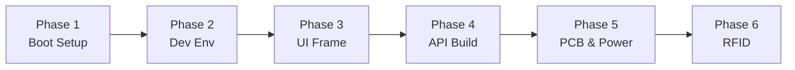

# Development Roadmap

## Visual Timeline

## Phase 1: Boot & Blink

Initial hardware setup and verification:
- Flash Raspberry Pi OS Lite (64-bit) onto microSD
- Boot Pi Zero 2 W, connect to WiFi
- Enable SSH and SPI interface (`raspi-config`)
- Connect 3.5" SPI display via GPIO header
- Install `fbtft` driver, verify display output
- Verify touch input (`evtest`)

**Milestone:** SSH into badge over WiFi, display showing framebuffer output

## Phase 2: Dev Environment

Development workflow setup:
- Set up cross-compilation on dev machine (aarch64 target)
- Create project structure
- Build and deploy "Hello Badge" binary
- Create deploy script (SCP + SSH)
- Verify Slint renders to SPI framebuffer (`/dev/fb1`)
- If Slint is too heavy for 512MB, evaluate alternatives

**Milestone:** Edit -> Deploy -> Run in <30 seconds

## Phase 3: Display Framework

UI implementation:
- Set up Slint UI framework (or alternative if needed)
- Create basic badge layout (480x320 resolution)
- Display static avatar image
- Display profile info (name, tagline, socials)
- Implement touch interactions

**Milestone:** Avatar and name displaying on badge

## Phase 4: Dynamic Content

API and live updates:
- Implement Axum HTTP server
- POST /api/avatar endpoint
- POST /api/profile endpoint
- Connect API to UI state
- Test from phone/PC over WiFi

**Milestone:** Upload avatar from phone, badge updates live

## Phase 5: PCB Design & Power Management

Custom PCB and production readiness:
- Design schematic in EasyEDA (charging, boost, connectors)
- Layout PCB (~85x55mm, 2-layer)
- Order from JLCPCB, assemble
- Implement battery monitoring (ADC via SPI or I2C fuel gauge)
- Systemd auto-start service
- Low power optimizations (screen dimming, WiFi sleep)
- Battery level display in UI

**Milestone:** Self-contained wearable badge on custom PCB, full-day battery

## Phase 6: RFID Integration (Future)

Door key functionality:
- Identify door lock frequency
- Acquire Chameleon Tiny
- Clone existing card to Chameleon
- Implement serial communication via UART header on PCB
- Add UI for card slot switching
- Test with actual door

**Milestone:** Badge is also door key
