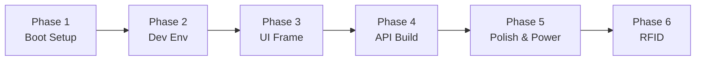

# Development Roadmap

## Visual Timeline

## Phase 1: Boot & Blink

Initial hardware setup and verification:
- Flash Raspberry Pi OS Lite (64-bit)
- Assemble hardware stack
- First boot, verify display works
- Connect to WiFi
- Enable SSH
- Verify touch input (`evtest`)

**Milestone:** SSH into badge over WiFi

## Phase 2: Dev Environment

Development workflow setup:
- Set up cross-compilation on dev machine
- Create project structure
- Build and deploy "Hello Badge" binary
- Create deploy script

**Milestone:** Edit → Deploy → Run in <30 seconds

## Phase 3: Display Framework

UI implementation:
- Set up Slint UI framework
- Create basic badge layout
- Display static avatar image
- Display profile info
- Implement touch interactions

**Milestone:** Avatar and name displaying on badge

## Phase 4: Dynamic Content

API and live updates:
- Implement Axum HTTP server
- POST /api/avatar endpoint
- POST /api/profile endpoint
- Connect API to UI state
- Test from phone/PC

**Milestone:** Upload avatar from phone, badge updates live

## Phase 5: Polish & Power

Production readiness:
- Systemd auto-start service
- Battery monitoring via GPIO
- Low power optimizations
- Screen dimming on idle
- Design acrylic enclosure
- Laser cut and assemble
- Add lanyard attachment

**Milestone:** Wearable for full day

## Phase 6: RFID Integration (Future)

Door key functionality:
- Identify door lock frequency
- Acquire Chameleon Tiny
- Clone existing card to Chameleon
- Implement serial communication
- Add UI for card slot switching
- Test with actual door

**Milestone:** Badge is also door key
