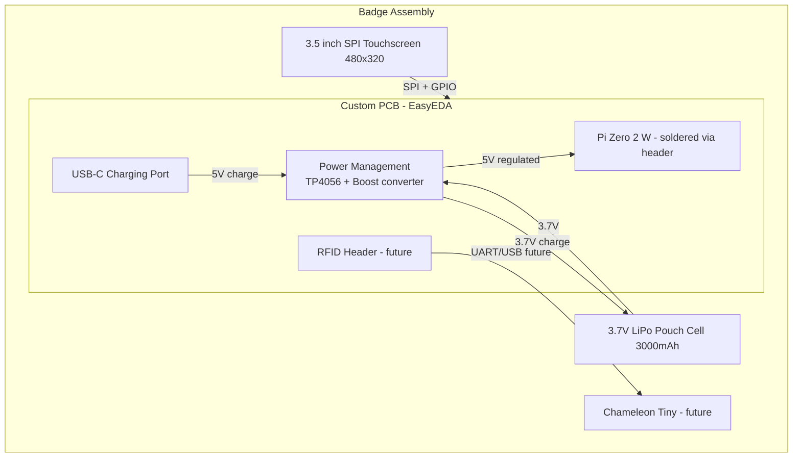

# Hardware Assembly

## Complete Hardware Stack



## Physical Overview

<!-- TODO: Add photo/render of assembled badge once PCB design is finalized -->


*Image pending — will be added after EasyEDA design is complete.*

## Physical Layout (top to bottom)

```
┌─────────────────────────┐
│   3.5" SPI Display      │  ← Front face (visible)
│   (480 x 320)           │
├─────────────────────────┤
│   Custom PCB             │  ← Middle layer
│   ┌───────────────────┐ │
│   │ Pi Zero 2 W       │ │
│   │ (via 40-pin hdr)  │ │
│   └───────────────────┘ │
│   [TP4056] [Boost] [SW] │
│   [USB-C]  [JST]  [LED] │
├─────────────────────────┤
│   LiPo Pouch Cell        │  ← Back layer (flat)
│   (3.7V 3000mAh)        │
├─────────────────────────┤
│   Lanyard clip / hook    │
└─────────────────────────┘
```

## Estimated Dimensions

| Layer         | Dimensions (approx)      |
| ------------- | ------------------------ |
| Display       | ~85 x 55 x 4mm          |
| Custom PCB    | ~85 x 55 x 2mm          |
| Pi Zero 2 W   | 65 x 30 x 5mm (on PCB)  |
| LiPo cell     | ~75 x 50 x 5mm          |
| **Total**     | **~85 x 55 x 16mm**     |

## Considerations

### Weight Estimate

| Component       | Weight    |
| --------------- | --------- |
| Display (3.5")  | ~40-50g   |
| Pi Zero 2 W     | ~10g      |
| Custom PCB      | ~15-20g   |
| LiPo 3000mAh   | ~50-60g   |
| Connectors/misc | ~5-10g    |
| **Total**       | **~120-150g** |

Much lighter than the CM4 design (350-450g). Comfortable for all-day wear.

### Thermal

- Pi Zero 2 W runs significantly cooler than CM4 (~1.5W vs ~3-5W)
- No heatsink required for badge workload (static display + light API)
- PCB copper layers provide passive heat spreading
- If needed, a small copper pad on the PCB under the SoC can help

### Battery Life Estimate

- Pi Zero 2 W + 3.5" SPI display + WiFi active: ~2-2.5W
- 3000mAh LiPo @ 3.7V = ~11.1Wh
- Boost converter efficiency ~85%: ~9.4Wh usable
- **Estimated runtime: ~4-5 hours continuous**
- With screen dimming on idle: ~6-8 hours
- With aggressive power management (WiFi sleep, CPU throttle): ~8-10 hours

### Power Circuit

```
USB-C 5V ──> TP4056 ──> LiPo Cell (3.7V)
                              │
                              ▼
                        Boost Converter (3.7V -> 5V)
                              │
                              ▼
                    Pi Zero 2 W (5V via GPIO pin 2/4)
                              │
                              ▼
                    3.5" Display (3.3V via Pi header)
```

- TP4056 handles LiPo charging with overcharge/overdischarge protection
- Boost converter provides stable 5V from 3.0-4.2V LiPo range
- Power switch between boost output and Pi input
- Voltage divider on battery to ADC (GPIO) for battery level monitoring

### Display Connection

SPI via GPIO header — single flat ribbon or direct pin-to-pin if display sits on top of the PCB. See `overview.md` for pinout.

### Lanyard Attachment

- Two mounting holes on PCB corners (M2 or M2.5)
- Lanyard clip threads through holes or attaches via small carabiner
- Alternative: adhesive lanyard mount on back of LiPo cell
