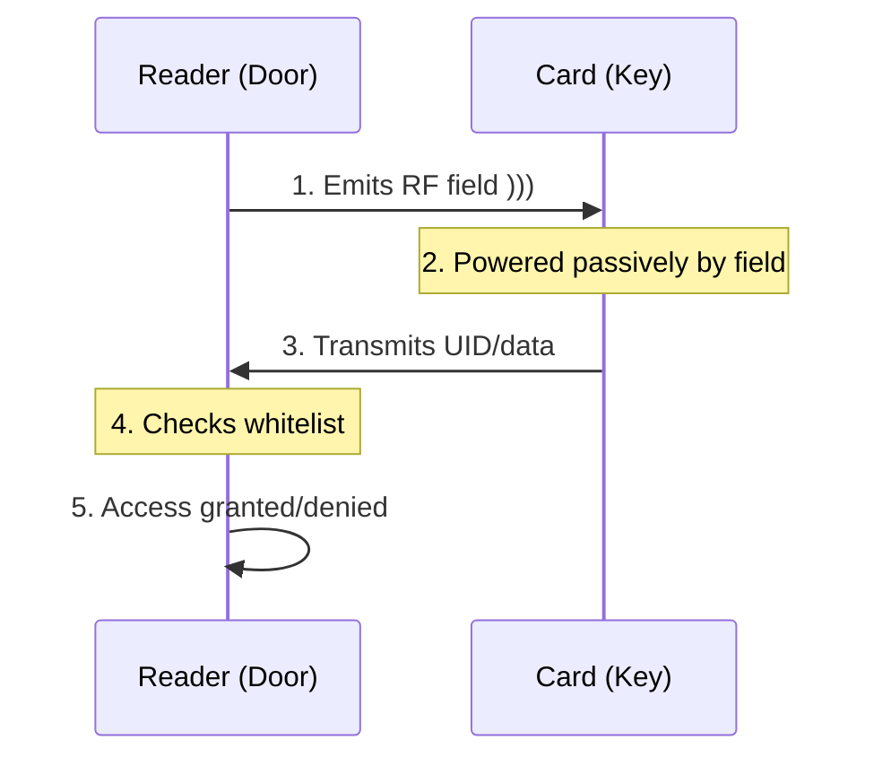

# RFID Technical Guide (Future Phase)

## How RFID Door Locks Work



## Two Frequencies

| Frequency | Names            | Use             | Security       |
| --------- | ---------------- | --------------- | -------------- |
| 125 kHz   | EM4100, HID Prox | Older buildings | Low (UID only) |
| 13.56 MHz | MIFARE, NFC      | Modern systems  | Varies         |

## Reader vs Emulator

| Type                           | Function              | Badge Use             |
| ------------------------------ | --------------------- | --------------------- |
| Reader (RC522, PN532)          | Reads/writes cards    | Cannot act as card    |
| Emulator (Chameleon, Proxmark) | Pretends to BE a card | Required              |

## Recommended: Chameleon Tiny/Ultra

- Supports both frequencies
- USB serial interface
- Multiple card slots
- Controllable from Rust via `serialport` crate

## Identify Your Door Lock First

```
Method 1: Check card for "HID" (125kHz) or "MIFARE" (13.56MHz)
Method 2: Try scanning with Android NFC (if reads = 13.56MHz)
Method 3: Ask building management
```
