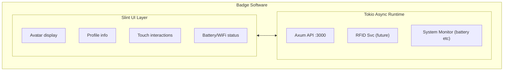

# Software Architecture

## Tech Stack

| Layer         | Choice     | Rationale                            |
| ------------- | ---------- | ------------------------------------ |
| Language      | Rust       | Developer preference, performance    |
| Async Runtime | Tokio      | Industry standard                    |
| UI Framework  | Slint      | Designed for embedded, touch support |
| HTTP Server   | Axum       | Lightweight, async, Rust-native      |
| GPIO/SPI      | rppal      | Best Pi GPIO library for Rust        |
| Serial (RFID) | serialport | For Chameleon communication          |

## System Architecture

