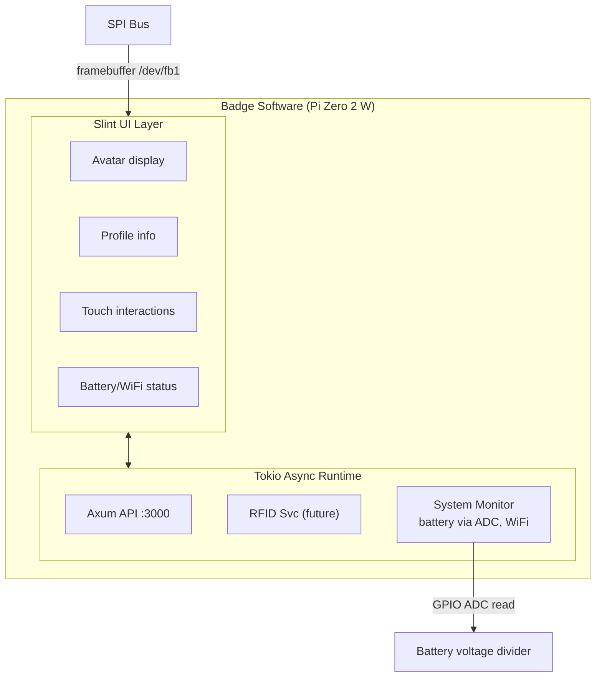

# Software Architecture

## Tech Stack

| Layer         | Choice     | Rationale                            |
| ------------- | ---------- | ------------------------------------ |
| Language      | Rust       | Developer preference, performance    |
| Async Runtime | Tokio      | Industry standard                    |
| UI Framework  | Slint      | Designed for embedded, touch support |
| HTTP Server   | Axum       | Lightweight, async, Rust-native      |
| GPIO/SPI      | rppal      | Best Pi GPIO library for Rust        |
| Serial (RFID) | serialport | For Chameleon communication          |

### Low-RAM Considerations (512MB)

The Pi Zero 2 W has 512MB RAM. The current stack (Slint + Tokio + Axum) should fit within this budget, but may need adjustment:

- **Slint**: Designed for embedded systems, supports software rendering. Should work well on 512MB. If too heavy, alternatives:
  - `embedded-graphics` + framebuffer — minimal memory, direct SPI writes
  - `minifb` — lightweight framebuffer window
  - Raw framebuffer (`/dev/fb0`) with custom rendering
- **Tokio**: Use `current_thread` runtime instead of `multi_thread` to reduce memory overhead
- **Axum**: Lightweight, should be fine on 512MB
- **General**: Avoid loading full-resolution images into memory. Resize on upload, cache display-sized versions

### SPI Display Driver

The 3.5" SPI display (ILI9486/ILI9488) needs a framebuffer driver:

- **Kernel driver**: `fbtft` module creates `/dev/fb1` — Slint can render to this
- **Device tree overlay**: `dtoverlay=piscreen` or custom overlay for specific display
- **Userspace alternative**: Direct SPI writes via `rppal` SPI — more control, more work
- **Recommended**: Use `fbtft` kernel module for simplicity, Slint renders to framebuffer

## System Architecture



### Display Pipeline

```
Slint UI ──> Framebuffer (/dev/fb1) ──> fbtft driver ──> SPI ──> ILI9486 panel
```

### Battery Monitoring Pipeline

```
LiPo ──> Voltage divider ──> MCP3008 ADC (SPI) ──> rppal read ──> System Monitor
                              or MAX17048 (I2C)
```
