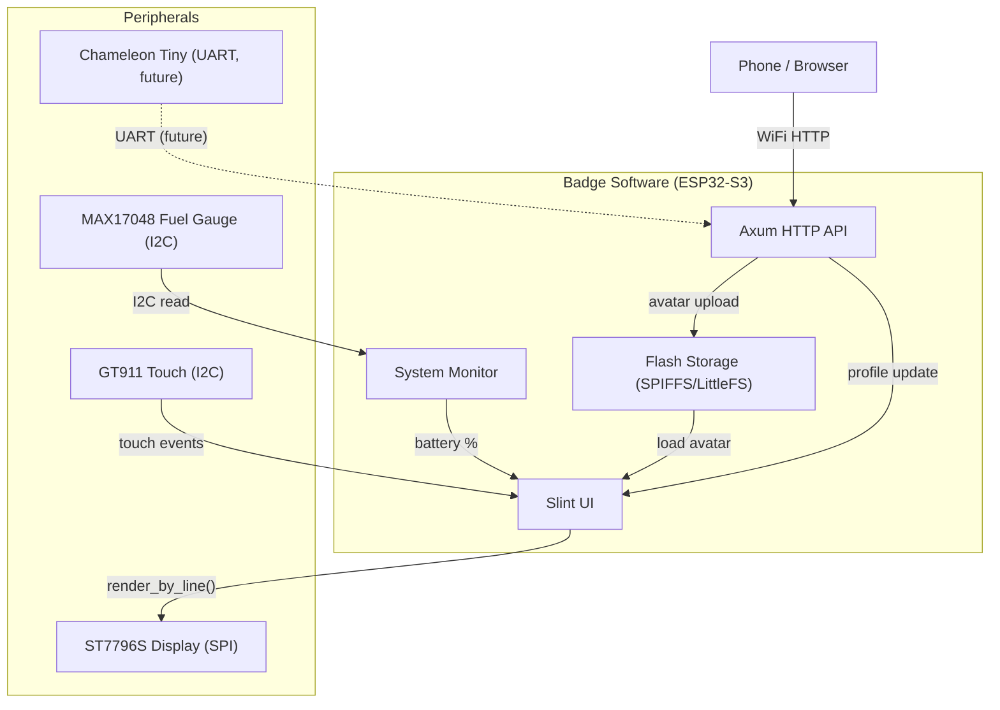

# Software Architecture

## System Overview



## Tech Stack

```
Tokio (async runtime)          — works on ESP32-S3 via esp-idf
Axum (HTTP server)             — works with mio_unsupported_force_poll_poll flag
Slint (UI framework)           — officially supported, line-by-line rendering
esp-idf-hal (GPIO/SPI/I2C)    — hardware abstraction
esp-idf-svc (WiFi, NVS)       — WiFi and storage management
SPIFFS/LittleFS                — flash-based filesystem for images
```

## Slint on MCU

From the Slint embedded documentation, the key configuration:

**Cargo features needed (default-features = false):**
- `compat-1-2`
- `renderer-software`
- `unsafe-single-threaded`
- `libm`

**Rendering strategy — line-by-line (`render_by_line()`):**
- Renders one horizontal line at a time instead of a full framebuffer
- Memory per line: ~960 bytes (480 pixels x 2 bytes RGB565)
- Use dual line buffers with DMA for async SPI writes
- Slint runtime fits in <300KB RAM
- Build script must set `EmbedResourcesKind::EmbedForSoftwareRenderer`

## Data Flow

### Avatar Upload

```
Phone -> POST /api/avatar (multipart) -> Axum handler
  -> resize/convert to RGB565 -> write to SPIFFS/LittleFS
  -> notify Slint UI -> re-render with new avatar
```

### Profile Update

```
Phone -> POST /api/profile (JSON) -> Axum handler
  -> write to NVS (non-volatile storage)
  -> notify Slint UI -> re-render with new text
```

### Battery Monitoring

```
MAX17048 (I2C) -> periodic read -> System Monitor
  -> update Slint UI battery indicator
  -> expose via GET /api/status
```

### Touch Input

```
GT911 interrupt (TP_INT) -> I2C read coordinates
  -> map to Slint input event -> UI handles interaction
```

## Storage Layout

```
16MB Flash:
  ~4MB  - Firmware (application binary)
  ~12MB - Data partition (SPIFFS or LittleFS)
           +-- avatar.bin    (current avatar, RGB565)
           +-- profile.json  (name, tagline, socials)
           +-- config.json   (WiFi credentials, display settings)
```

For `std` mode, esp-idf's VFS layer maps the data partition to a file path (e.g., `/data/`), so standard `std::fs` calls work transparently.

## API Endpoints

See [API documentation](./api.md) for full endpoint specifications.

| Method | Endpoint | Description |
|--------|----------|-------------|
| POST | /api/avatar | Upload new avatar image |
| POST | /api/profile | Update name, tagline, socials |
| GET | /api/status | Battery %, WiFi strength, uptime |
| GET | /api/health | Simple healthcheck |
| GET | /api/rfid/slots | List stored cards (future) |
| POST | /api/rfid/slot/:id | Activate card slot (future) |
