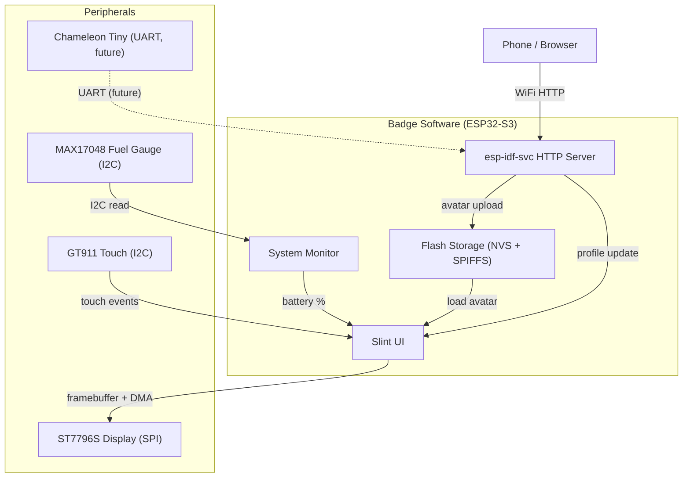

# Software Architecture

## System Overview



## Tech Stack

```
Slint (UI framework)           — software renderer, full framebuffer with dirty-rect updates
esp-idf-svc (HTTP, WiFi, NVS) — synchronous HTTP server, WiFi AP, non-volatile storage
esp-idf-hal (GPIO/SPI/I2C)    — hardware abstraction (SPI display, I2C touch, PWM backlight)
SPIFFS                         — flash-based filesystem for images (mounted at /storage)
```

## Slint on MCU

From the Slint embedded documentation, the key configuration:

**Cargo features needed (default-features = false):**
- `compat-1-2`
- `renderer-software`
- `unsafe-single-threaded`
- `libm`

**Rendering strategy — full framebuffer with dirty-rect DMA:**
- Full 480x320 RGB565 framebuffer (300KB) allocated in PSRAM via `heap_caps_malloc`
- Slint's dirty tracking identifies changed rectangles (typically 3-7 per frame)
- Only dirty rectangles are sent to the display over SPI
- 4KB DMA buffer allocated in internal SRAM for SPI transfers
- `mipidsi` batches pixels into the SPI buffer automatically
- Build script must set `EmbedResourcesKind::EmbedForSoftwareRenderer`

## Data Flow

### Avatar Upload

```
Phone (browser) -> resize to 150x150, strip alpha (RGBA -> RGB)
  -> POST /api/avatar (raw RGB888, 67,500 bytes) -> HTTP handler
  -> store in pending slot -> main loop picks up
  -> save to SPIFFS (/storage/avatar.rgb) + update Slint UI
```

### Profile Update

```
Phone -> POST /api/profile (JSON, max 4KB) -> HTTP handler
  -> store in pending slot -> main loop picks up
  -> save to NVS (namespace "badge", key "profile")
  -> update Slint UI text + colors
```

### Battery Monitoring (planned)

```
MAX17048 (I2C, addr 0x36) -> periodic read -> System Monitor
  -> update Slint UI battery indicator
  (currently hardcoded to 100% — driver not yet implemented)
```

### Touch Input

```
Main loop polls GT911 (I2C) -> read touch coordinates
  -> coordinate transform (portrait GT911 -> landscape display)
  -> dispatch Slint events (Pressed/Moved/Released/Exited)
```

### Captive Portal

```
DNS server (UDP :53, background thread, 4KB stack)
  -> all A-record queries resolve to AP IP (TTL 60s)

HTTP captive portal detection:
  /generate_204          (Android / Chrome OS)
  /hotspot-detect.html   (iOS / macOS)
  /connecttest.txt       (Windows)
  /canonical.html        (Firefox)
  + wildcard /*          (fallback)
  -> 302 redirect to http://<AP_IP>/  -> serves embedded SPA
```

### Backlight Control

```
Settings page slider (10-100%) -> on_brightness_changed callback
  -> LEDC PWM on GPIO 7 (25kHz, 8-bit resolution)
  -> debounced (2% threshold to avoid flicker)
  -> starts at 50% brightness on boot
```

## Storage Layout

```
16MB Flash:
  ~4MB  - Firmware (application binary)
  ~12MB - SPIFFS partition (mounted at /storage)
           +-- avatar.rgb      (150x150 raw RGB888, 67.5KB)
           +-- background.rgb  (480x320 raw RGB888, 450KB)

NVS (non-volatile storage, separate partition):
  namespace "badge":
    key "profile" -> JSON string (display name, tagline, socials, colors)
```

For `std` mode, esp-idf's VFS layer maps the SPIFFS partition to `/storage/`, so standard `std::fs` calls work transparently. NVS is accessed via `esp-idf-svc`'s `EspNvs` API.

## API Endpoints

See [API documentation](./api.md) for full endpoint specifications.

| Method | Endpoint | Description | Status |
|--------|----------|-------------|--------|
| GET | /api/health | Simple healthcheck | Implemented |
| GET | /api/profile | Get current profile as JSON | Implemented |
| POST | /api/profile | Update name, tagline, socials, colors | Implemented |
| POST | /api/avatar | Upload avatar image (raw RGB888) | Implemented |
| POST | /api/background | Upload background image (raw RGB888) | Implemented |
| DELETE | /api/background | Clear background (revert to solid color) | Implemented |
| GET | /api/status | Battery %, WiFi strength, uptime | Planned |
| GET | /api/rfid/slots | List stored cards | Future |
| POST | /api/rfid/slot/:id | Activate card slot | Future |
