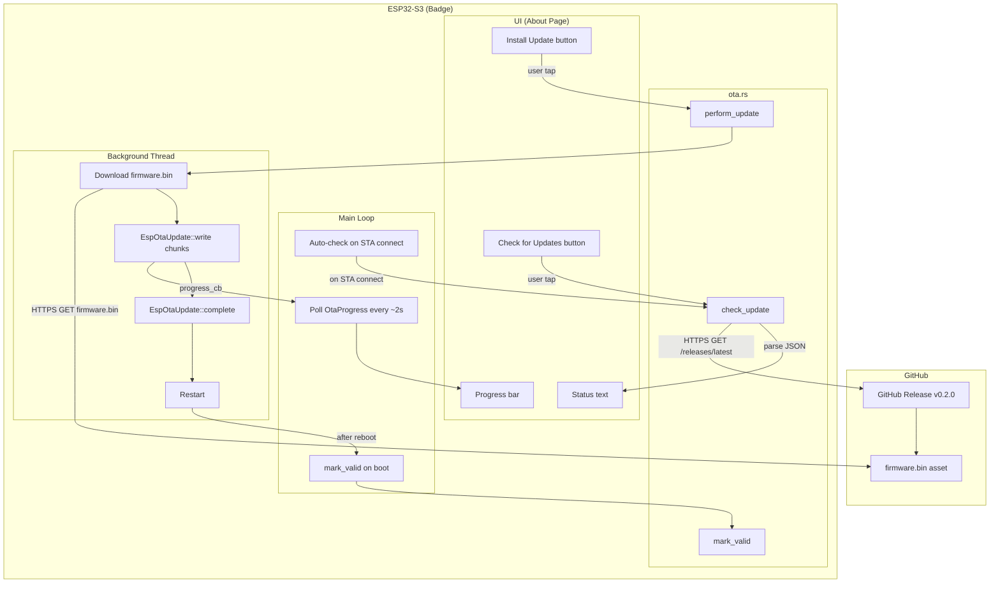
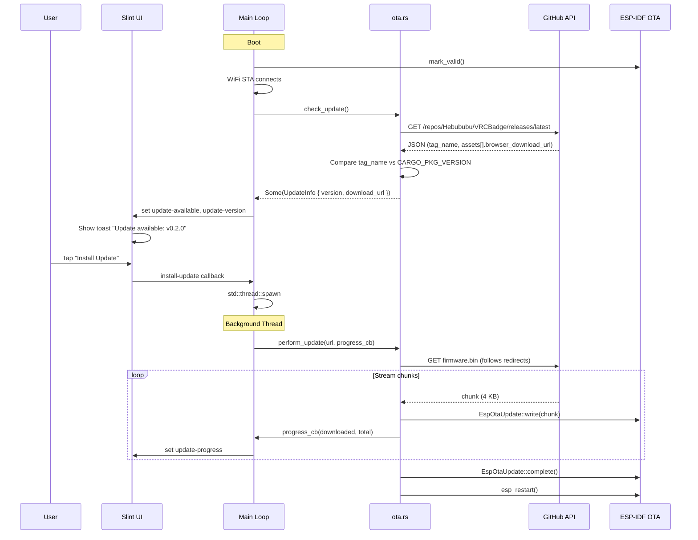
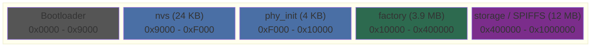

# OTA Firmware Update via GitHub Releases

## Overview

When the badge connects to WiFi (STA mode), it checks GitHub for a newer
firmware release. If one exists, it shows a notification and an "Install
Update" button on the About page. The user taps to download and flash the
new firmware via ESP-IDF's OTA mechanism, then the device reboots.

## Decisions

| Decision              | Answer                                              |
|-----------------------|-----------------------------------------------------|
| GitHub repo           | `Hebububu/VRCBadge`                                 |
| API endpoint          | `https://api.github.com/repos/Hebububu/VRCBadge/releases/latest` |
| Tag format            | `v0.1.0` (with `v` prefix)                          |
| Asset filename        | `firmware.bin`                                       |
| Version comparison    | Strip `v` prefix, compare strings (no semver lib)   |
| JSON parsing          | Simple string search (no serde_json)                |
| Update trigger        | Auto-check on STA connect + manual button on About  |
| Update flow           | User taps "Install Update" -> background thread -> reboot |
| Progress updates      | `Arc<Mutex<>>` struct polled by main loop            |
| Rollback protection   | `mark_valid()` at boot + ESP-IDF automatic rollback  |
| Partition layout      | ota_0 (3 MB) + ota_1 (3 MB) + SPIFFS (~10 MB)       |

## Architecture



## Update Flow (Sequence)



## Partition Table

### Current (factory, no OTA)



### New (OTA-capable)

```mermaid
block-beta
    columns 1
    block:flash["16 MB Flash"]:1
        BL["Bootloader\n0x0000 - 0x9000"]
        NVS["nvs (24 KB)\n0x9000 - 0xF000"]
        OD["otadata (8 KB)\n0xF000 - 0x11000"]
        PHY["phy_init (4 KB)\n0x11000 - 0x20000"]
        OTA0["ota_0 (3 MB)\n0x20000 - 0x320000"]
        OTA1["ota_1 (3 MB)\n0x320000 - 0x620000"]
        STO["storage / SPIFFS (~10 MB)\n0x620000 - 0x1000000"]
    end

    style BL fill:#555,color:#fff
    style NVS fill:#4a6fa5,color:#fff
    style OD fill:#b5651d,color:#fff
    style PHY fill:#4a6fa5,color:#fff
    style OTA0 fill:#2d6a4f,color:#fff
    style OTA1 fill:#1b4332,color:#fff
    style STO fill:#7b2d8b,color:#fff
```



```csv
# Name,     Type, SubType, Offset,   Size
nvs,        data, nvs,     0x9000,   0x6000
otadata,    data, ota,     0xF000,   0x2000
phy_init,   data, phy,     0x11000,  0x1000
ota_0,      app,  ota_0,   0x20000,  0x300000
ota_1,      app,  ota_1,   0x320000, 0x300000
storage,    data, spiffs,  0x620000, 0x9E0000
```

**Breaking change**: existing devices require full re-flash. SPIFFS data
(avatar, background) will be lost.

## ota.rs API

```rust
pub struct UpdateInfo {
    pub version: String,
    pub download_url: String,
}

/// Check GitHub for a newer release.
pub fn check_update() -> anyhow::Result<Option<UpdateInfo>>

/// Download and flash firmware via OTA.
/// Calls progress_cb(downloaded_bytes, total_bytes) during download.
pub fn perform_update(
    url: &str,
    progress_cb: impl FnMut(usize, usize),
) -> anyhow::Result<()>

/// Mark running firmware as valid (prevents rollback on next reboot).
pub fn mark_valid() -> anyhow::Result<()>
```

## UI Changes (About Page)

Below the existing four info rows (~220px free space):

```
| ---------------------------------------- |
| SOFTWARE UPDATE                          |  Section header (14px, #555580)
| ---------------------------------------- |
| Status     Up to date / v0.2.0 available |  Dynamic status row
| ---------------------------------------- |
| [Check for Updates]    [Install Update]  |  Buttons (blue / green)
| ---------------------------------------- |
| [===============>          ] 45%         |  Progress bar (during OTA)
| ---------------------------------------- |
```

### New BadgeUI properties

| Property           | Type   | Default      | Description                        |
|--------------------|--------|--------------|------------------------------------|
| `update-available` | bool   | false        | Whether a newer version exists     |
| `update-version`   | string | ""           | Remote version (e.g., "0.2.0")     |
| `update-status`    | string | ""           | Human-readable status text         |
| `update-progress`  | float  | 0.0          | Download progress (0.0 to 1.0)     |

### New BadgeUI callbacks

| Callback           | Description                              |
|--------------------|------------------------------------------|
| `check-update()`   | Triggers `ota::check_update()`           |
| `install-update()` | Triggers `ota::perform_update()` on thread |

## Threading

`perform_update()` blocks for 30-60 seconds. Runs on a separate
`std::thread`. Progress shared via `Arc<Mutex<OtaProgress>>` polled
by the main loop every ~2 seconds.

```rust
enum OtaState {
    Idle,
    Checking,
    UpdateAvailable,
    Downloading,
    Installing,
    Done,
    Failed(String),
}

struct OtaProgress {
    state: OtaState,
    downloaded: usize,
    total: usize,
}
```

## HTTPS / TLS Notes

- GitHub API requires `User-Agent` header (rejects without it)
- Asset downloads redirect through `objects.githubusercontent.com` ->
  need `FollowRedirectsPolicy::FollowAll`
- Certificate bundle (~60 KB flash) for TLS verification
- ~40-50 KB heap per TLS connection; one connection at a time
- Set `crt_bundle_attach: Some(esp_crt_bundle_attach)` on HTTP client config

### sdkconfig.defaults additions

```
CONFIG_MBEDTLS_CERTIFICATE_BUNDLE=y
CONFIG_MBEDTLS_CERTIFICATE_BUNDLE_DEFAULT_FULL=y
CONFIG_BOOTLOADER_APP_ROLLBACK_ENABLE=y
```

## Risks & Mitigations

| Risk                            | Mitigation                                         |
|---------------------------------|----------------------------------------------------|
| JSON parsing without serde      | Simple string search for tag_name + download URL   |
| TLS memory (~50 KB)             | One connection at a time; close after each request |
| Download interrupted mid-OTA    | EspOtaUpdate validates on complete(); old FW stays  |
| New firmware crashes            | mark_valid() + ESP-IDF automatic rollback           |
| GitHub rate limit (60 req/hr)   | Check once per STA connect + manual button only    |
| Partition table change          | Full re-flash required (accepted)                  |

## Stages

### Stage 1: Partition table + OTA backend
**Goal**: OTA-capable partition layout, `ota.rs` module with check/update/mark_valid
**Files**: `partitions.csv`, `sdkconfig.defaults`, `firmware/src/ota.rs`, `firmware/src/main.rs`
**Success Criteria**: Firmware builds and boots with new partition table; `mark_valid()` succeeds at startup
**Tests**: Boot log shows ota_0 partition; `check_update()` returns result from GitHub API
**Status**: Not started

### Stage 2: UI + wiring
**Goal**: About page update section, callbacks wired, auto-check on STA connect
**Files**: `ui/badge.slint`, `firmware/src/main.rs`
**Success Criteria**: "Check for Updates" calls GitHub API; "Install Update" downloads and flashes OTA
**Tests**: Create a test GitHub release with firmware.bin; verify full update cycle with reboot
**Status**: Not started
